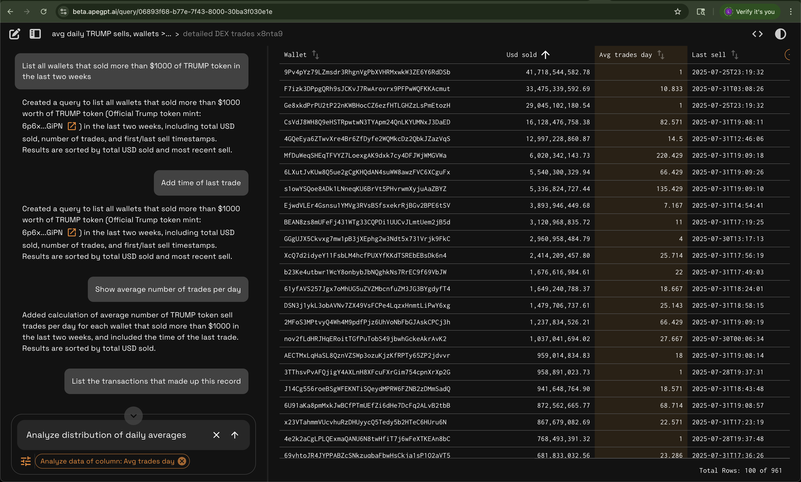

## TL;DR

Semantic Grid is an open-source interface that lets users explore complex crypto datasets using natural language — no SQL or rigid filters required. Instead of pre-built dashboards with fixed views, users describe what they want to see. The system builds live, interactive tables in response.

[](https://semanticgrid.ai)

## Built for Crypto Analytics Teams

Today’s dashboards are like storefronts: users must browse aisles of charts hoping to find what they need. But the number of ways people want to slice and explore on-chain data is endless. Semantic Grid puts users in control, making your data searchable, interactive, and composable — just like search engines revolutionized e-commerce. If you’re building:

- Wallet- or protocol-centric dashboards  
- DEX or NFT analytics  
- Revenue breakdowns or fee explorers  
- Airdrop or grant eligibility screens  

Semantic Grid is the frontend layer that makes your data self-service and natural-language-query enabled, right from the table UI.

## How It Works

1. **Query by prompt**  
   “Show all wallets that sold TRUMP token on Jupiter yesterday”  

2. **Data rendered as a live table**  
   Automatically generated via SQL under the hood  

3. **Composable, interactive editing**  
   “Add column for destination token”  
   “Show all tokens held by this wallet”  

4. **Stateful history & sharing**  
   Prompts, queries, and tables are versioned and sharable  

## Try It Live

*[Solana DEX Explorer (Demo)](https://semanticgrid.ai)*  
*[Watch Demo Video](https://youtu.be/5ySluirKR_M)*


## Getting Started

- [Read the Docs](docs/systems-architecture.md)
- [Join Discord](https://discord.gg/9bsR6sU7JQ)
- Deploy using Helm (bring your own compute)
- Plug in your foundation model (OpenAI, local models, etc.)
- Connect to your dataset and describe it using metadata + sample queries

# Building

## fm-app

```bash
docker buildx build --platform linux/amd64 -f apps/fm-app/Dockerfile -t <your org repo>/fm_app:latest .
```

## db-meta

```bash
docker buildx build --platform linux/amd64 -f apps/db-meta/Dockerfile -t <your org repo>/dbmeta:latest .
```

## web (UI)

```bash
docker buildx build --file apps/web/Dockerfile -t <your org repo>/web:latest .
 ```