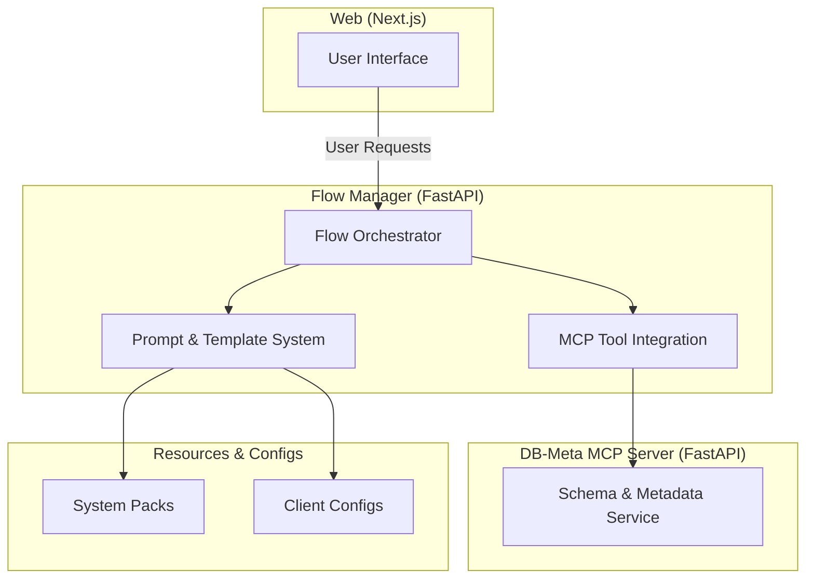
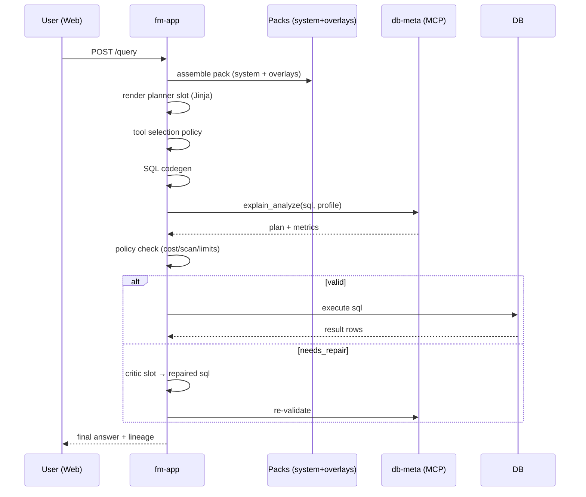

# Semantic Grid: System Architecture Overview

## 1. Architecture Diagram



---

## 2. Component Overview

### Flow Manager (apps/fm-app)

The Flow Manager is the core orchestration engine of Semantic Grid. It coordinates how user requests move through prompts, templates, and connected MCP tools. It acts as the “brain” of the system, managing state across sessions and ensuring that the correct packs and resources are included at each step.

The **prompt templating system** supports slot-based composition, where reusable fragments (`domain.md`, `system.md`, etc.) are dynamically inserted depending on the query context. Defaults (e.g., `__default/domain.md`) are resolved when slot-specific overrides are not found, making it easy to balance shared and specialized knowledge.

The main agentic flow in `fm-app` leverages a structured pipeline. Each step is explicitly logged and contextualized, allowing the system to persist intermediate artifacts (queries, responses, validation steps) that can be reused or inspected later. This design provides not only robustness but also transparency, as it is possible to see *how* an answer was derived by following the flow records.

Integration with MCP tools is a first-class feature. For example, SQL generated by the flow can be validated by passing it to a database MCP server (`db-meta`) with `EXPLAIN ANALYZE`. The orchestration layer handles such calls seamlessly, feeding validated results back into the reasoning process.

### DB-Meta MCP Server (apps/db-meta)

The db-meta component provides a structured interface to the underlying database schema and metadata. It introspects the active database using SQLAlchemy, merges structural information with YAML-based descriptions, and produces human-readable schema prompts. These prompts are essential for guiding LLM-driven query generation, as they combine technical accuracy with contextual clarity.

In addition to schema descriptions, db-meta can provide sample rows, enforce table/column visibility rules (via whitelists or hidden flags), and run lightweight query preflight checks (e.g., EXPLAIN ESTIMATE). This makes it not only a metadata provider but also a safety layer, ensuring that generated SQL queries are contextually valid and performant before execution. By centralizing schema awareness, db-meta allows the Flow Manager and other agents to remain focused on orchestration and reasoning rather than low-level database inspection.
### Web Frontend (apps/web)

The **Next.js frontend** serves as the main entry point for end users. It allows interactive querying, visualization of results, and inspection of intermediate steps. The frontend communicates with the Flow Manager via API, relaying user prompts and displaying structured results.

#### UI

The UI provides a conversational querying interface with real-time refinement. In the example below, the system is used to analyze large-scale token sell activity:


Here, the Flow Manager incrementally builds queries: starting from “List all wallets that sold more than \$1000 of TRUMP token,” then refining to include last trade timestamps, average trades per day, and distribution analysis. On the right, query results are displayed in tabular form, with sortable columns for wallet, USD sold, and trade frequency. This illustrates the tight integration of agentic query refinement with interactive data exploration.

### Resources & Configs (packages/...)

Reusable system packs (prompt templates, schemas, etc.) are stored under **`packages/resources`**, while client-specific overlays live in **`packages/client-configs`**. This separation makes it easy to maintain clean defaults while supporting tenant-specific overrides.

---

## 3. Typical Request Flow

1. **UI → fm-app**: user submits a natural-language request.
2. **Packs**: fm-app assembles the effective tree (system pack + client overlays), renders the current slot via Jinja.
3. **Planner**: proposes next tool and arguments (JSON output).
4. **Tool Selector**: enforces policy (e.g., validate before execute).
5. **Codegen**: deterministic or LLM-assisted SQL assembly.
6. **Validation**: fm-app calls `db-meta.explain_analyze` (MCP) and evaluates a `ValidationPolicy`.
7. **Repair Loop** (optional): if invalid, fm-app routes to **critic** to rewrite SQL; loop until acceptable or exhausted.
8. **Execute**: fm-app performs the DB call (or another MCP service) when validated.
9. **Summarize**: final response assembled; lineage (prompt shas, files, MCP inputs/outputs) persisted.

### Sequence Diagram (Mermaid)



---

## 4. Prompt Packs & Overlays

In details: [How-To Guide To Packs and Templates](./templates-how-to.md)

* **Directory roots**

  * System: `packages/resources/system-pack/vX.Y.Z/`
  * Client: `packages/client-configs/<client>/<env>/<component>/overlays/`
* **Slot files**

  * `slots/<slot>/prompt.md` (required)
  * Additional fragments (e.g., `domain.md`)
* **Defaults & Fallbacks**

  * Include with prioritized candidates:

    ```jinja
    
    
    ```
* **Merging**

  * Dicts: RFC-7386 deep merge (null deletes).
  * Lists: configurable (`append`, `unique`, `by_id`, `replace`) with per-node `strategy` and optional `id_key`.
* **Lineage**

  * Each render returns prompt hash + extras hashes + pack/overlay hashes + MCP call hashes.

---

## 5. MCP Surface (db-meta)

Recommended tools:

* `describe_provider(client?, env?)` → discover profiles/resources and file hashes.
* `get_prompt_bundle(profile, client?, env?, max_examples?)` → returns dialect, capabilities, instructions, schema card, examples, lineage.
* `explain_analyze(sql, profile?, client?, env?)` → normalized JSON plan/metrics for validation.

**Profiles** map to DB flavors/environments (e.g., `wh_v2`). fm-app chooses profile per tenant and step.

---

## 6. Policy & Control

* **Controller owns decisions**: prompts *propose*, fm-app *decides* (state machine / graph).
* **ValidationPolicy** gates execution: e.g., forbid full table scans, cap estimated runtime, require LIMIT, etc.
* **Retries**: steps return `ok / retryable(error) / fatal(error)`; controller handles backoff and repair loops.

---

## 7. Deployment Topology

* **Local dev**: Bun + Turbo for orchestration; fm-app & db-meta run via `uv` inside `apps/*`.
* **Containers**: each app containerized; packs/overlays mounted read-only.
* **Configs & Secrets**: fm-app reads Pydantic settings from env; MCP endpoints via settings.

---

## 8. Observability & Lineage

* Structured logs with run IDs, slot, step, and timings.
* Persist lineage: system pack version/hash, overlay hashes, rendered prompt hash, MCP input/output hashes.
* Metrics: latency per step, validation failure rates, loop counts.

---

## 9. Security & Compliance

* Principle of least privilege: MCPs access only required DBs; fm-app never embeds secrets in prompts.
* Validate all LLM-produced SQL prior to execution.
* Redact PII in logs and prompts.

---

## 10. Extensibility

* Add a new slot by creating `slots/<name>/prompt.md` and declaring it in the system pack manifest.
* Add a new MCP by registering a provider in fm-app and referencing it in slot metadata (`requires.mcp`).
* Add a tenant via `packages/client-configs/<client>/<env>/...` overlays.

---

## 11. Open Questions / Next Steps

* Define canonical `ValidationReport` schema across dialects.
* Add result caching for `explain_analyze` keyed by SQL+profile.
* Define a compact run artifact format (JSON) to export lineage and prompts.
