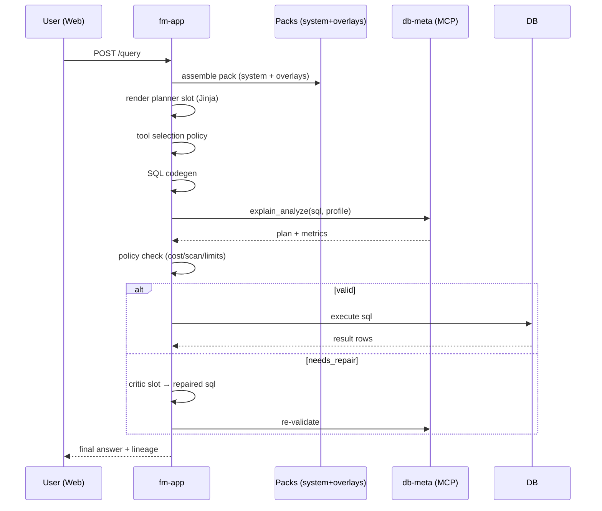

# Semantic Grid — Systems Architecture Overview

This document describes the high‑level architecture, core components, data flows, deployment topology, and operational concerns for the **Semantic Grid** project.

---

## 1) Goals & Non‑Goals

**Goals**

* Multi‑step, policy‑constrained agentic execution over enterprise data.
* Clean separation of *flow orchestration* (fm‑app) and *domain context providers* (MCP servers such as db‑meta and db‑ref).
* Reproducibility via prompt packs, overlays, and lineage.
* Pluggable validation (e.g., SQL `EXPLAIN/ANALYZE`) before execution.

**Non‑Goals**

* Direct storage of long‑term data inside fm‑app.
* Coupling front‑end rendering to orchestration internals.

---

## 2) Component Overview

* **apps/fm-app (Flow Manager)**

  * Orchestrates multi‑step flows (intent → planner → tool\_selector → codegen → validate → execute → summarize).
  * Loads **system packs** and **client overlays**, renders slot templates with Jinja, and attaches **lineage**.
  * Calls MCP tools deterministically (no DB work in prompts).

* **apps/db-meta (MCP: Database Metadata/Validation)**

  * Serves dialect capabilities, prompt instructions, schema cards, examples.
  * Exposes validation tools (e.g., `explain_analyze`) and profile‑aware bundles (`get_prompt_bundle`).

* **(Optional) apps/db-ref (MCP: Named Entities & RAG)**

  * Stores/resolves named entities; provides unstructured context for RAG.

* **apps/web (Next.js Frontend)**

  * UI for interactive queries, history, and run lineage. Talks to fm‑app APIs.

* **packages/resources (System Packs)**

  * Versioned base prompt packs (e.g., `system-pack/v1.0.0/slots/...`).

* **packages/client-configs (Client Overlays)**

  * Tenant/env overlays (e.g., `client/env/db-meta/overlays/...`).

---

## 3) Architecture Diagram (Mermaid)

```mermaid
flowchart LR
  subgraph Web[Web (Next.js)]
    UI[User Interface]
  end

  subgraph FM[fm-app (FastAPI)]
    Planner[Planner Slot]
    ToolSel[Tool Selector Slot]
    Codegen[SQL Codegen]
    Validate[SQL Validate]
    Execute[Execute]
    Store[Lineage & Logs]
  end

  subgraph MCP1[db-meta (MCP)]
    Bundle[get_prompt_bundle]
    Explain[explain_analyze]
  end

  subgraph Packs[Packs]
    System[packages/resources]
    Client[packages/client-configs]
  end

  UI -->|HTTP| FM
  FM -->|load packs| System
  FM -->|apply overlays| Client
  Planner --> ToolSel --> Codegen --> Validate --> Execute --> Store
  Validate -->|MCP tool| Explain
  Planner -->|context| Bundle
```

---

## 4) Typical Request Flow

1. **UI → fm‑app**: user submits a natural‑language request.
2. **Packs**: fm‑app assembles the effective tree (system pack + client overlays), renders the current slot via Jinja.
3. **Planner**: proposes next tool and arguments (JSON output).
4. **Tool Selector**: enforces policy (e.g., validate before execute).
5. **Codegen**: deterministic or LLM‑assisted SQL assembly.
6. **Validation**: fm‑app calls `db-meta.explain_analyze` (MCP) and evaluates a `ValidationPolicy`.
7. **Repair Loop** (optional): if invalid, fm‑app routes to **critic** to rewrite SQL; loop until acceptable or exhausted.
8. **Execute**: fm‑app performs the DB call (or another MCP service) when validated.
9. **Summarize**: final response assembled; lineage (prompt shas, files, MCP inputs/outputs) persisted.

### Sequence Diagram (Mermaid)



---

## 5) Prompt Packs & Overlays

* **Directory roots**

  * System: `packages/resources/system-pack/vX.Y.Z/`
  * Client: `packages/client-configs/<client>/<env>/<component>/overlays/`
* **Slot files**

  * `slots/<slot>/prompt.md` (required)
  * Additional fragments (e.g., `domain.md`)
* **Defaults & Fallbacks**

  * Include with prioritized candidates:

    ```jinja
    
    
    ```
* **Merging**

  * Dicts: RFC‑7386 deep merge (null deletes).
  * Lists: configurable (`append`, `unique`, `by_id`, `replace`) with per‑node `strategy` and optional `id_key`.
* **Lineage**

  * Each render returns prompt hash + extras hashes + pack/overlay hashes + MCP call hashes.

---

## 6) MCP Surface (db-meta)

Recommended tools:

* `describe_provider(client?, env?)` → discover profiles/resources and file hashes.
* `get_prompt_bundle(profile, client?, env?, max_examples?)` → returns dialect, capabilities, instructions, schema card, examples, lineage.
* `explain_analyze(sql, profile?, client?, env?)` → normalized JSON plan/metrics for validation.

**Profiles** map to DB flavors/environments (e.g., `wh_v2`). fm‑app chooses profile per tenant and step.

---

## 7) Policy & Control

* **Controller owns decisions**: prompts *propose*, fm‑app *decides* (state machine / graph).
* **ValidationPolicy** gates execution: e.g., forbid full table scans, cap estimated runtime, require LIMIT, etc.
* **Retries**: steps return `ok / retryable(error) / fatal(error)`; controller handles backoff and repair loops.

---

## 8) Deployment Topology

* **Local dev**: Bun + Turbo for orchestration; fm‑app & db‑meta run via `uv` inside `apps/*`.
* **Containers**: each app containerized; packs/overlays mounted read‑only.
* **Configs & Secrets**: fm‑app reads Pydantic settings from env; MCP endpoints via settings.

---

## 9) Observability & Lineage

* Structured logs with run IDs, slot, step, and timings.
* Persist lineage: system pack version/hash, overlay hashes, rendered prompt hash, MCP input/output hashes.
* Metrics: latency per step, validation failure rates, loop counts.

---

## 10) Security & Compliance

* Principle of least privilege: MCPs access only required DBs; fm‑app never embeds secrets in prompts.
* Validate all LLM‑produced SQL prior to execution.
* Redact PII in logs and prompts.

---

## 11) Extensibility

* Add a new slot by creating `slots/<name>/prompt.md` and declaring it in the system pack manifest.
* Add a new MCP by registering a provider in fm‑app and referencing it in slot metadata (`requires.mcp`).
* Add a tenant via `packages/client-configs/<client>/<env>/...` overlays.

---

## 12) Open Questions / Next Steps

* Define canonical `ValidationReport` schema across dialects.
* Add result caching for `explain_analyze` keyed by SQL+profile.
* Define a compact run artifact format (JSON) to export lineage and prompts.
